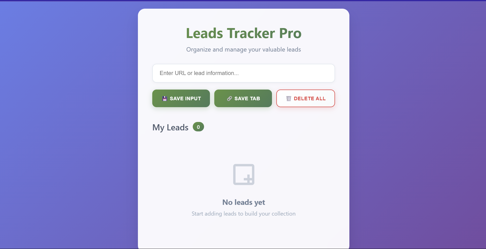
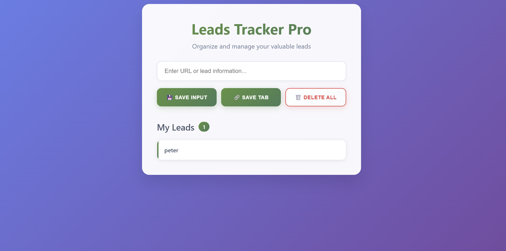

# 🚀 Leads Tracker Pro

A beautiful and modern Chrome extension for saving and managing your valuable leads with style!


## ✨ Features

- 🎨 **Beautiful Modern UI** - Glassmorphism design with smooth animations
- 🔗 **Save Current Tab** - Capture any website URL with one click
- 💾 **Manual Input** - Add custom URLs or lead information
- 📊 **Lead Counter** - Real-time count of saved leads
- 🗑️ **Bulk Delete** - Clear all leads with double-click protection
- 💨 **Keyboard Shortcuts** - Press Enter to quickly save inputs
- 📱 **Responsive Design** - Works perfectly on all screen sizes
- 🔄 **Persistent Storage** - Your leads are saved between browser sessions

## 🖼️ Screenshots

### Main Interface


### Empty State


## 📁 Project Structure

```
leads-tracker-pro/
├── manifest.json          # Chrome extension configuration
├── index.html             # Main popup HTML
├── style.css              # Modern styling with animations
├── script.js              # Core functionality and Chrome API
├── README.md              # This file
└── icons/                 # Extension icons (optional)
    ├── icon16.png
    ├── icon48.png
    └── icon128.png
```

## 🚀 Installation

### Method 1: Install as Chrome Extension (Recommended)

1. **Download the files**
   ```bash
   git clone https://github.com/yourusername/leads-tracker-pro.git
   cd leads-tracker-pro
   ```

2. **Open Chrome Extensions**
   - Navigate to `chrome://extensions/`
   - Enable "Developer mode" (toggle in top-right corner)

3. **Load the Extension**
   - Click "Load unpacked"
   - Select the project folder
   - The extension will appear in your toolbar

4. **Start Using**
   - Click the extension icon in Chrome
   - Begin saving your valuable leads!

### Method 2: Run as Web Application

1. **Download the files** (same as above)
2. **Open `index.html`** in your browser
3. **Note**: The "Save Tab" feature won't work without Chrome extension permissions

## 🔧 Usage

### Saving Leads

1. **Save Current Tab**
   - Click the 🔗 "Save Tab" button
   - Current page URL is automatically captured

2. **Manual Entry**
   - Type URL or lead info in the input field
   - Click 💾 "Save Input" or press Enter

3. **View Leads**
   - All saved leads appear in the list below
   - Click any lead to open in a new tab

### Managing Leads

- **Delete All**: Double-click the 🗑️ "Delete All" button
- **Lead Counter**: Shows total number of saved leads
- **Persistent Storage**: Leads are automatically saved

## 🛠️ Technical Details

### Built With

- **HTML5** - Semantic structure
- **CSS3** - Modern styling with:
  - Glassmorphism effects
  - CSS Grid & Flexbox
  - Smooth animations
  - Responsive design
- **JavaScript ES6+** - Core functionality with:
  - Chrome Tabs API
  - Local Storage API
  - Event handling
  - DOM manipulation

### Chrome Extension APIs Used

- **`chrome.tabs`** - Access current tab information
- **`localStorage`** - Persistent data storage
- **Manifest V3** - Latest extension standard

### Browser Compatibility

- ✅ Chrome (Latest)
- ✅ Chromium-based browsers (Edge, Opera, Brave)
- ❌ Firefox (Different extension API)
- ❌ Safari (Different extension API)

## 🎨 Customization

### Changing Colors

Edit the CSS variables in `style.css`:

```css
:root {
  --primary-color: #5f9341;
  --secondary-color: #4a7c59;
  --danger-color: #e53e3e;
}
```

### Modifying Animations

Adjust animation timings in `style.css`:

```css
.transition {
  transition: all 0.3s ease;
}
```

### Adding Features

Extend functionality in `script.js`:

```javascript
// Add new features here
function newFeature() {
  // Your code here
}
```

## 📝 File Descriptions

| File | Purpose |
|------|---------|
| `manifest.json` | Chrome extension configuration and permissions |
| `index.html` | Main popup structure and layout |
| `style.css` | Complete styling with modern design system |
| `script.js` | Core functionality and Chrome API integration |

## 🐛 Troubleshooting

### Common Issues

**Extension not loading?**
- Ensure Developer mode is enabled
- Check console for errors
- Verify all files are in the same folder

**"Save Tab" not working?**
- Make sure you installed as Chrome extension
- Check if tabs permission is granted
- Refresh the extension if needed

**Leads not saving?**
- Check if localStorage is enabled
- Clear browser cache and try again
- Ensure script.js is loading properly

## 🤝 Contributing

1. Fork the repository
2. Create a feature branch (`git checkout -b feature/amazing-feature`)
3. Commit your changes (`git commit -m 'Add amazing feature'`)
4. Push to the branch (`git push origin feature/amazing-feature`)
5. Open a Pull Request

## 📄 License

This project is licensed under the MIT License - see the [LICENSE](LICENSE) file for details.

## 🌟 Acknowledgments

- Inspired by modern web design trends
- Built with Chrome Extension best practices
- Designed for productivity and ease of use

## 📞 Support

If you have any questions or issues:

- 📧 Email: mburukiganya@gmail.com
- 🐛 Issues: [GitHub Issues](https://github.com/kiganyamburu/leads-tracker-pro/issues)
- 💬 Discussions: [GitHub Discussions](https://github.com/kiganyamburu/leads-tracker-pro/discussions)

---

<div align="center">

**Made with ❤️ for productivity enthusiasts**

[⭐ Star this project](https://github.com/yourusername/leads-tracker-pro) • [🐛 Report Bug](https://github.com/yourusername/leads-tracker-pro/issues) • [💡 Request Feature](https://github.com/yourusername/leads-tracker-pro/issues)

</div>